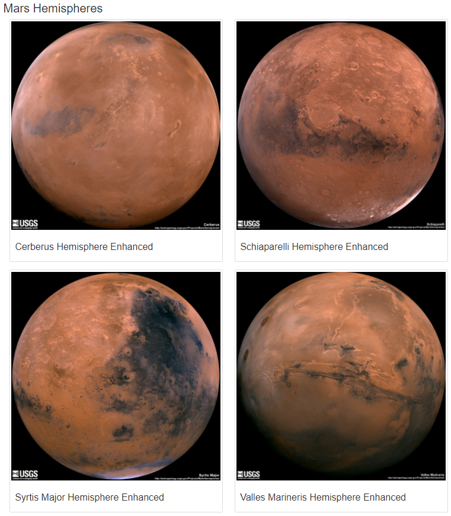

# Mission-to-Mars 

**Overview of the analysis:**

I am creating a web app using BeautifulSoup and Splinter to scrape full-resolution images of Mars’s hemispheres and the titles of those images, store the scraped data on a Mongo database, use a web application to display the data, and alter the design of the web app to accommodate these images. 

**Results:**

1.Created a web app which is responsive to screen size 

2.Stored in mongo database

